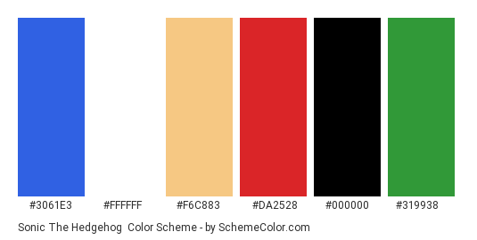
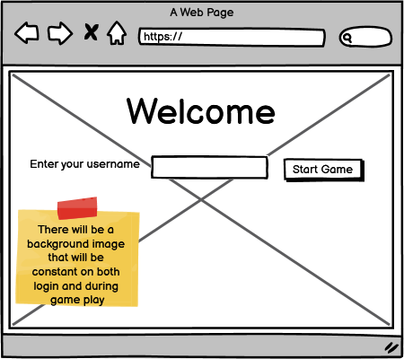
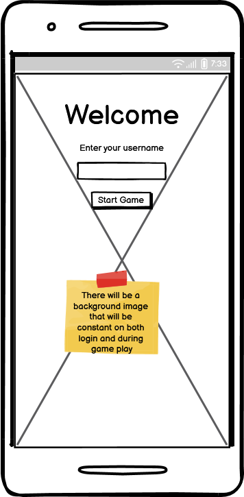
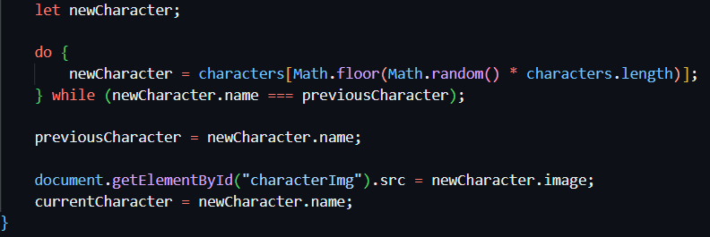
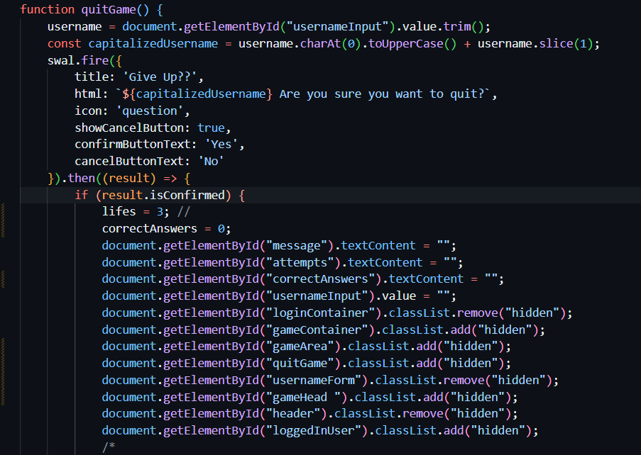

# Love Running

This interactive game challenges players to guess the names of various characters from classic animated series which may envoke some childhood memories. 

# User Stories

## **First Time User Goals:**
- As a user, the option to enter my username and begin playing should be clearly visible and easy to follow
- The game interface should provide tooltips or hints to help me understand the purpose of each feature.
- As a user, I want to be able to view the current High scores so that I have a goal to aim for as I play.
- As a user, I want to understand the business's operating hours for future reference when planning to visit.
- As a user, I do not want to be distracted by pop-up alerts, all alerts should only appear when necessary.
- As a user, I want to have the option to Quit the game if I decide to do so. 

## **Returning User Goals:**
- Upon returning to the game, I should be greeted with a familiar interface that reflects my previous progress.
- As a user, I want to view my previous highest score if I do have one.

## **Frequent User Goals:**
- As a user, I want to be constantly challenged with new character sets or gameplay modes to keep the experience fresh and exciting.

 
# Features 

## The Colour Scheme
The color scheme used was based on the Super Mario Sonic the Hedgehog game.  The colours used are bright and fun.

## The Fonts Used

The fonts used were bright and bold to emphazise the fun aspect of the game. The fonts used were carefully chosen as to not over power any other features of the website and protrayed the neccassary information in a clear easy to read mannor.

- [Abril Fatface](https://fonts.google.com/specimen/Abril+Fatface) 
- [Comic Sans MS] (https://freefonts.co/fonts/comic-sans-ms-regular)
- [sans-serif](https://www.myfonts.com/pages/sans-serif-fonts)

## Wireframes
### Desktop and Mobile User Login Page
 <&nbsc>  

### Desktop and Mobile Subpages
  

### Existing Features
## Features

### Existing Features

- **Username Entry**: Featured prominently on the landing page, users are prompted to enter their username to begin the game.
  - This feature ensures personalized gameplay experience including personalized messages.
- **Character Guessing**: Users are presented with an image of a character from some well known cartoon series's and are prompted to guess the character's name.
  - This feature engages users by testing their knowledge of the iconic characters from the series.
- **Game Messages**: Informative messages are displayed to guide users through the gameplay and provide feedback on their guesses.
  - This feature enhances the user experience by offering clear instructions and feedback.
- **Quit Button**: Users have the option to quit the game at any time by clicking the "Quit" button.
  - This feature provides users with flexibility and control over their gaming experience.
  -**High Scores**: Users have the option to view the current High Scores by clicking the "High Scores" button.
  - This feature provides users with a target to reach when playing the game, if the User quits the game their score is not recorded to the High Scores table.

### Usage

1. **Username Entry**: Users are required to enter their username in the designated input field.
2. **Start Game**: After entering their username, users can click on the "Start Game" button to begin.
3. **Guessing Characters**: Users are presented with an image of a Cartoon Character and a list of possible answers to choose from.
4. **Check Guess**: After selecting the radio button with the possible correct guess, userslivesclick on the "Check" button to submit their answer and receive feedback.
5. **Game Progress**: Users are given three lives to begin with, each wrong guess for a single Character means a life is lost.  If the User guesses correctly for that Cartoon Character before they have lost all three lifes then the lifes are reset on the next image shown. They can continue guessing characters until they loose all their lives or correctly identify all characters or decide to quit the game.

### Future Features

- **Timer**: Introduce a timer feature to add an element of challenge and excitement to the gameplay.

- **Animation**:  Add animations for character transitions and guessing feedback.

## Testing 

### Challenges

Character Repetition: Initially, there was an issue where characters could repeat consecutively, affecting the game's randomness. However, I was able to resolve this by looping through the selection process until a different character is picked. Once a new character is selected, its image is displayed, and its name is stored as the current character. This prevents repetition and ensures a fresh character is always shown.

Quit Button Functionality: Implementing the quit button to return to the login screen was a challenge initially. However, thorough testing and debugging resolved this issue, and now the quit button function resets all relevant game variables and UI elements to their initial states, effectively restarting the game.

### Validator Testing 

- HTML
  - No errors were returned when passing through the official [W3C validator](https://validator.w3.org/nu/?doc=https%3A%2F%2Fcode-institute-org.github.io%2Flove-running-2.0%2Findex.html)
- CSS
  - No errors were found when passing through the official [(Jigsaw) validator](https://jigsaw.w3.org/css-validator/validator?uri=https%3A%2F%2Fvalidator.w3.org%2Fnu%2F%3Fdoc%3Dhttps%253A%252F%252Fcode-institute-org.github.io%252Flove-running-2.0%252Findex.html&profile=css3svg&usermedium=all&warning=1&vextwarning=&lang=en#css)

### Unfixed Bugs

There are no known bugs in the application.

## Deployment

This section should describe the process you went through to deploy the project to a hosting platform (e.g. GitHub) 

- The site was deployed to GitHub pages. The steps to deploy are as follows: 
  - In the GitHub repository, navigate to the Settings tab 
  - From the source section drop-down menu, select the Master Branch
  - Once the master branch has been selected, the page will be automatically refreshed with a detailed ribbon display to indicate the successful deployment. 

The live link can be found here - https://code-institute-org.github.io/love-running-2.0/index.html 

## Credits 

In this section you need to reference where you got your content, media and extra help from. It is common practice to use code from other repositories and tutorials, however, it is important to be very specific about these sources to avoid plagiarism. 

You can break the credits section up into Content and Media, depending on what you have included in your project. 

### Content 

- The text for the Home page was taken from Wikipedia Article A
- Instructions on how to implement form validation on the Sign Up page was taken from [Specific YouTube Tutorial](https://www.youtube.com/)
- The icons in the footer were taken from [Font Awesome](https://fontawesome.com/)

### Media

- The photos used on the home and sign up page are from This Open Source site
- The images used for the gallery page were taken from this other open source site

Congratulations on completing your Readme, you have made another big stride in the direction of being a developer! 

## Other General Project Advice

Below you will find a couple of extra tips that may be helpful when completing your project. Remember that each of these projects will become part of your final portfolio so it’s important to allow enough time to showcase your best work! 

- One of the most basic elements of keeping a healthy commit history is with the commit message. When getting started with your project, read through [this article](https://chris.beams.io/posts/git-commit/) by Chris Beams on How to Write  a Git Commit Message 
  - Make sure to keep the messages in the imperative mood 

- When naming the files in your project directory, make sure to consider meaningful naming of files, point to specific names and sections of content.
  - For example, instead of naming an image used ‘image1.png’ consider naming it ‘landing_page_img.png’. This will ensure that there are clear file paths kept. 

- Do some extra research on good and bad coding practices, there are a handful of useful articles to read, consider reviewing the following list when getting started:
  - [Writing Your Best Code](https://learn.shayhowe.com/html-css/writing-your-best-code/)
  - [HTML & CSS Coding Best Practices](https://medium.com/@inceptiondj.info/html-css-coding-best-practice-fadb9870a00f)
  - [Google HTML/CSS Style Guide](https://google.github.io/styleguide/htmlcssguide.html#General)

Getting started with your Portfolio Projects can be daunting, planning your project can make it a lot easier to tackle, take small steps to reach the final outcome and enjoy the process! 
